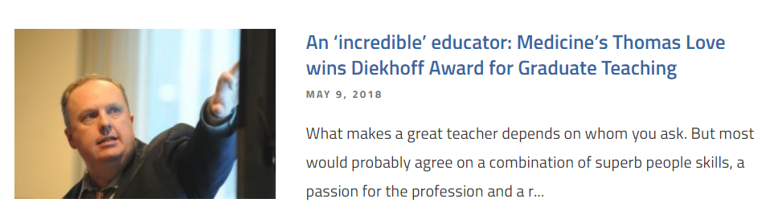
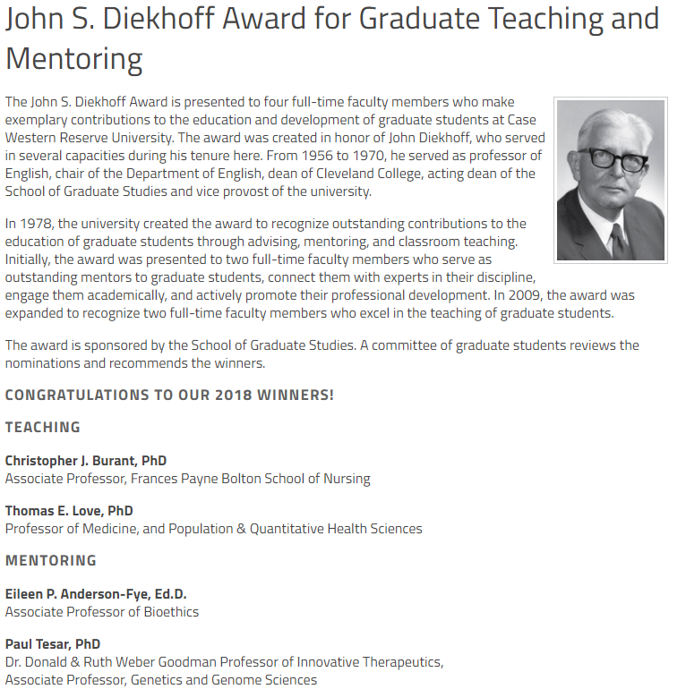

# Diekhoff 2018

I received the 2018 John S. Diekhoff Award for Graduate Teaching at CWRU.

- **Article** The CWRU Daily produced a [very kind article about me and this award](http://thedaily.case.edu/incredible-educator-medicines-thomas-love-wins-diekhoff-award-graduate-teaching/), and a [PDF of the article is here](https://github.com/THOMASELOVE/diekhoff-2018/blob/master/Diekhoff_text_TheDaily_2018-05-09.pdf)
- **Audio Recording** A student of mine (Ryan Honomichl) was good enough to record Provost Bud Baeslack and the many other people who busted into my class on April 6, 2018 to announce that I had won the award. A [seven-minute audio clip from that recording is here](https://raw.githubusercontent.com/THOMASELOVE/diekhoff-2018/master/Surprised_Diekhoff_Award_TEL_432_2018-04-06.mp3) if you want to hear me overwhelmed and tongue-tied.

## Thank You

I would like to sincerely thank every single person who helped me achieve this recognition (and there are thousands of people to thank) and I would also like to thank everyone who reads this page. Some of the many people that I am especially grateful to are listed below.

- My parents, who were the best possible parents for me.
- My family and friends, close and near, who put up with me, and who muster enthusiasm for each of my "projects".
- Every student I've ever had, at CWRU, and at the University of Pennsylvania before that.
- R. Henry Olaisen, Frances Wang and the many students who were involved in my being considered for this award.
- Christine Lee and her many colleagues who evaluated the nominations in addition to their productive work as graduate students.
- The past and present staff, faculty and administration of Case Western Reserve University, its School of Medicine, its Weatherhead School of Management and its Graduate School of Arts & Sciences.
- The teaching assistants I've had over the years that have made it possible for me to aim high, especially Claudia Cabrera, David Ngendahimana, Raj Sarabu, Mustafa Ascha, Terry Cui, Omar Alaber, Bob Winkelman, Rosie Conic, Noemi Hall and Theresa Roeder.
- Past and present mentors, friends and colleagues in education, including but by no means limited to Randy Cebul, David Hildebrand, Mendel Singer, Jonathan Haines, Doug Einstadter, Chris Burant, Shirley Moore, Scott Williams, Farren Briggs, Daniel Tisch, Apostolos Burnetas, George Vairaktarakis, Danny Solow, Kamlesh Mathur, Peter Ritchken, Fred Collopy, Julia Grant, Betty Vandenbosch, Doug Gunzler, Ben Hanson, Mike Baiocchi, Frank Yoon, Bo Lu, Jill Barnholtz-Sloan, Keith Hagans, Diane Solov, Rita Horwitz, Chuck Greinert, Dave Margolius, Shari Bolen, Jennifer Bailit, Mark Votruba, Harry Roberts, Bill Parr, Laura Lee Johnson, Andrew Gelman, Hadley Wickham, Jenny Bryan, Chester Ismay, James O'Malley, Elizabeth Stuart, Chris Schmid, Sally Morton, Anirban Basu, Annie Simpson, J.B. Silvers, Scott Husak, Steven Lewis, Charles Thomas, Paul Rosenbaum, Abba Krieger, Donald Morrison, Robert Stine and Bruce Vogeli. And lots and lots of other people.

